# Market E-commerce App

## Overview

Market E-commerce is a comprehensive mobile shopping application built with Flutter. The app provides users with a seamless and intuitive shopping experience, allowing them to browse, search, and purchase products from various categories. With features like product filtering, favoriting, cart management, and secure checkout, Market E-commerce delivers a complete online shopping solution for modern consumers.

## Features

- **User Authentication** - Secure login, registration, and password recovery options
- **Personalized Profiles** - User accounts with customizable preferences and settings
- **Product Catalog** - Browse products by categories, brands, and popularity
- **Search Functionality** - Find products quickly with robust search capabilities
- **Product Details** - Comprehensive information including images, descriptions, and ratings
- **Shopping Cart** - Add, remove, and manage items before checkout
- **Favorites System** - Save preferred items for future reference
- **Secure Checkout** - Complete purchase process with multiple payment options
- **Order Tracking** - Monitor order status and delivery progress
- **Dark/Light Mode** - Customizable app appearance with theme options
- **Responsive Design** - Works seamlessly across different screen sizes and orientations
- **Offline Capability** - Basic functionality available without internet connection

## Project Structure

```
├── lib/
│   ├── core/                      # Core functionality and utilities
│   │   ├── Api/                   # API handling and endpoints
│   │   ├── cache/                 # Local data caching
│   │   ├── routing/               # App navigation and routes
│   │   ├── services/              # Application services
│   │   ├── utils/                 # Helper functions and constants
│   │   └── widgets/               # Shared UI components
│   │
│   ├── Feature/                   # Feature modules
│   │   ├── cart/                  # Shopping cart functionality
│   │   ├── checkout/              # Payment and order processing
│   │   ├── favorite/              # Wishlist functionality
│   │   ├── home/                  # Home screen and product browsing
│   │   ├── login/                 # User authentication
│   │   ├── profile/               # User profile management
│   │   ├── register/              # New user registration
│   │   ├── search/                # Product search functionality
│   │   └── splash/                # App launch and onboarding
│   │
│   ├── cubit/                     # State management
│   └── main.dart                  # Application entry point
│
├── images/                        # App images and assets
└── web/                           # Web platform configuration
```
## 📸 Screenshots

### 🔹 Onboarding
| Splash | Onboarding 1 | Onboarding 2 | Onboarding 3 |
|--------|--------------|--------------|--------------|
| 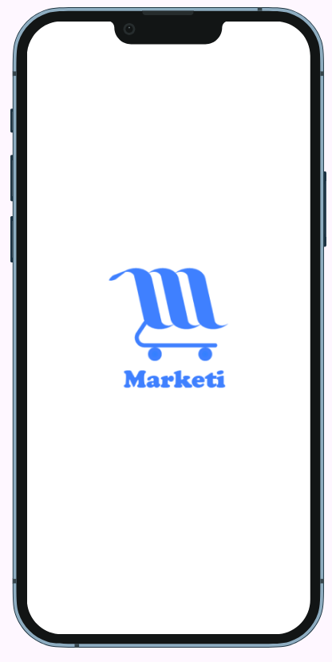 | 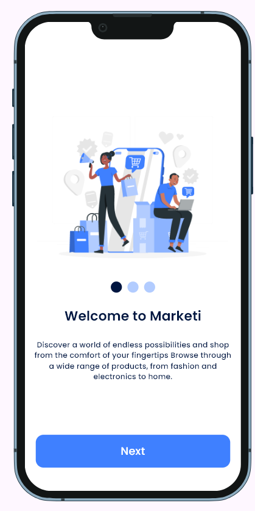 | 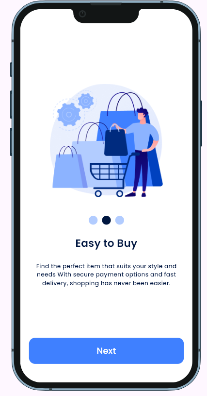 | 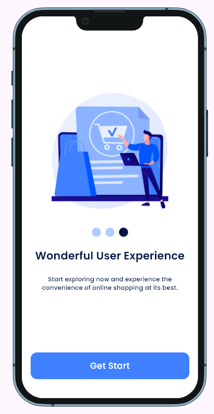 |

### 🔹 Authentication
| Login | Register | Forget Password (Mail) | Forget Password (Phone) |
|-------|----------|--------------------------|--------------------------|
| 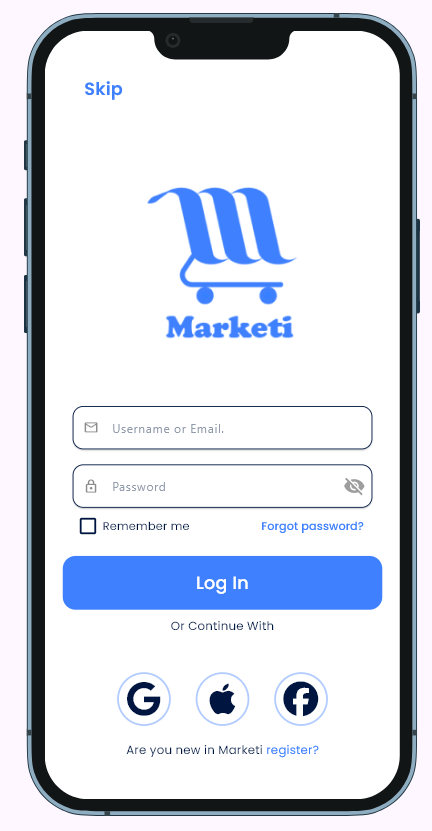 | 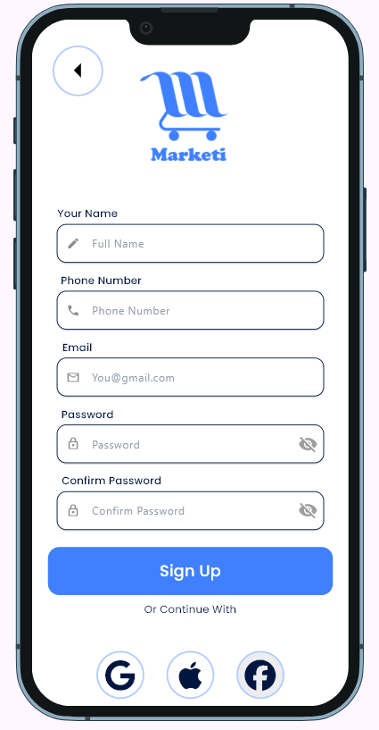 | 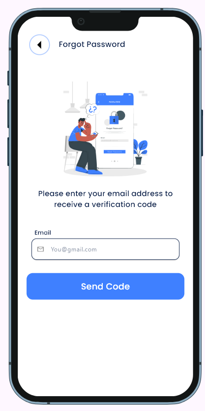 | 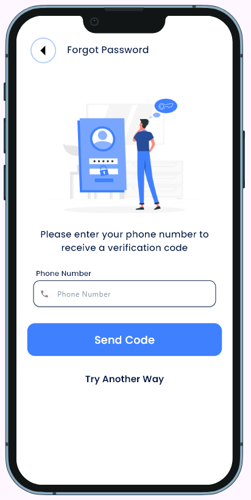 |

### 🔹 Home & Products
| Home | All Products | Product Details |
|------|--------------|-----------------|
| 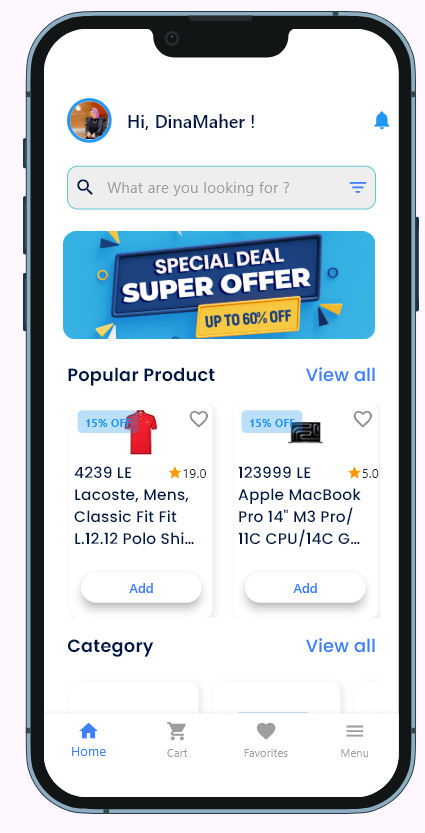 | 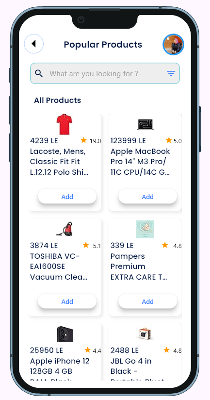 | 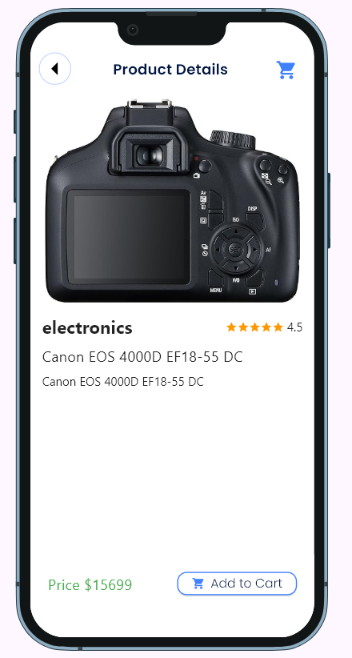 |

### 🔹 Cart
| Cart Light | Cart Dark |
|------------|-----------|
| 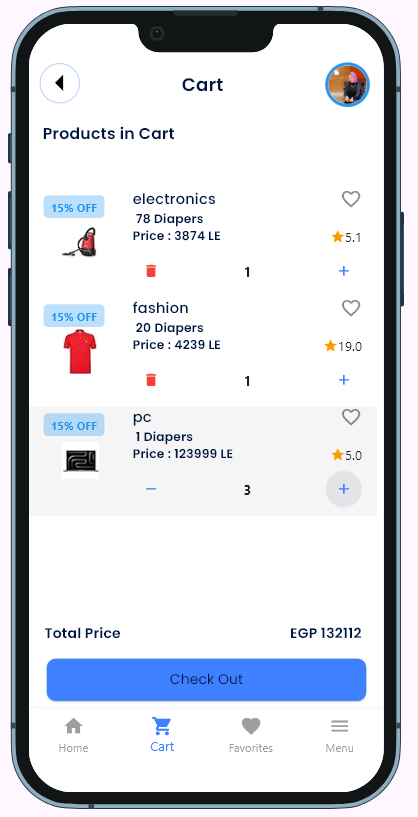 | 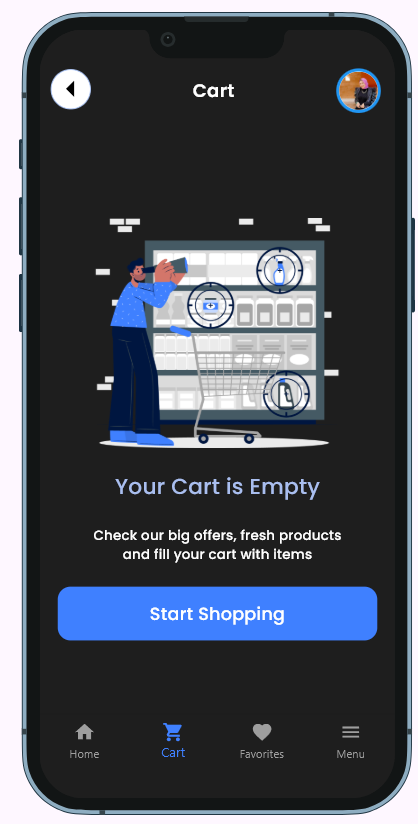 |

### 🔹 Favorites
| Favorites Light | Favorites Dark |
|-----------------|----------------|
| 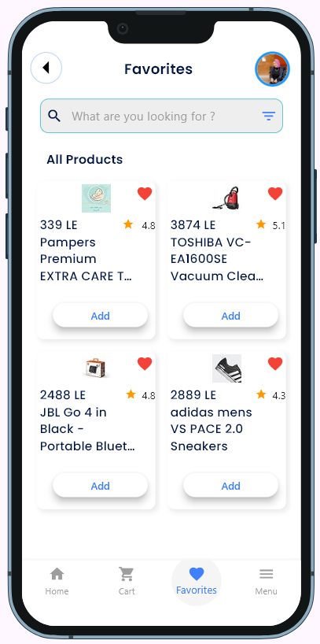 | 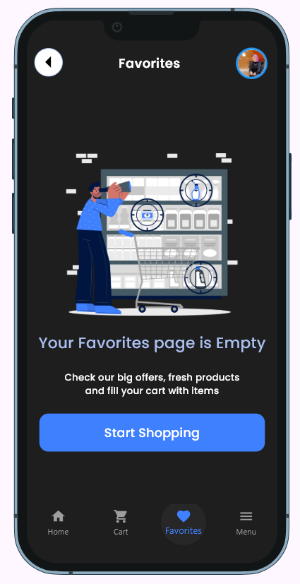 |

### 🔹 Profile & Edit
| Profile | Edit Profile |
|---------|--------------|
| 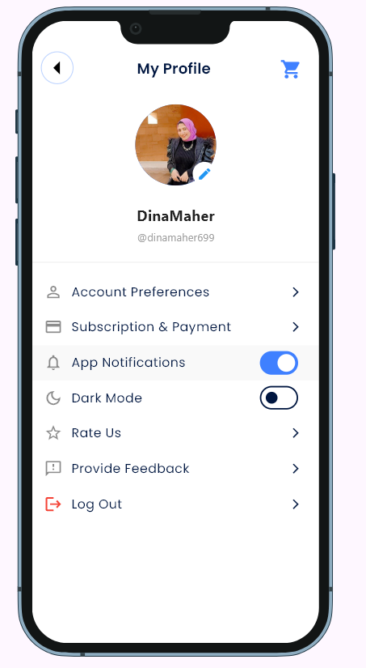 | 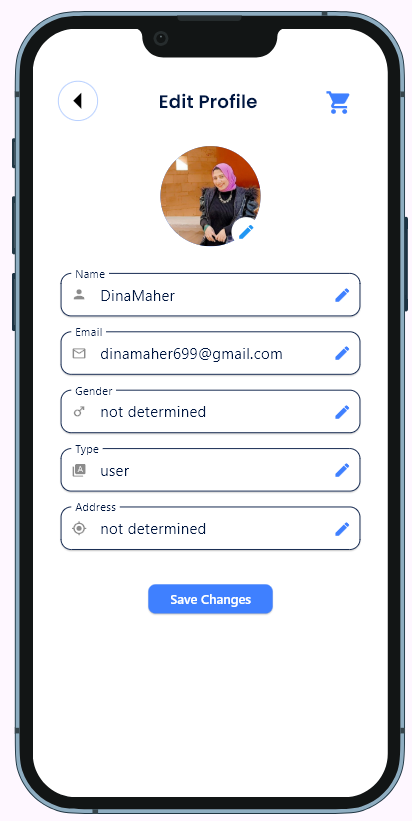 |

### 🔹 Menu
| Menu |
|------|
| 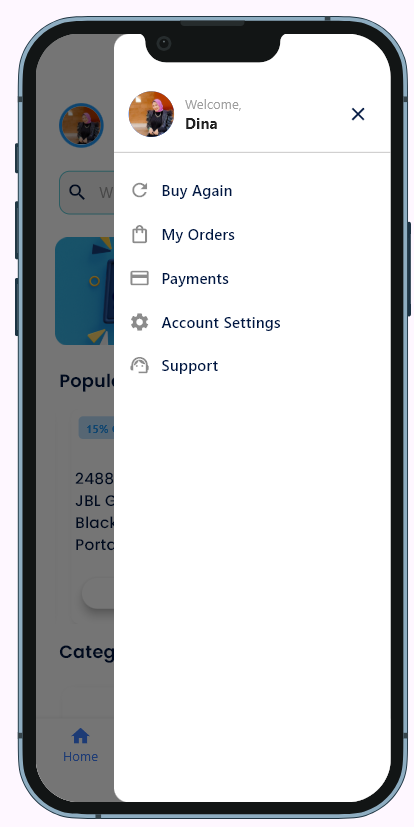 |

---

### 🎥📱 App Preview (GIFs)
| Part 1 |
|--------|
|  | 

| Part 2 |
|--------|
|  |

| Part 3 |
|--------|
|  |

| Part 4 |
|--------|
| 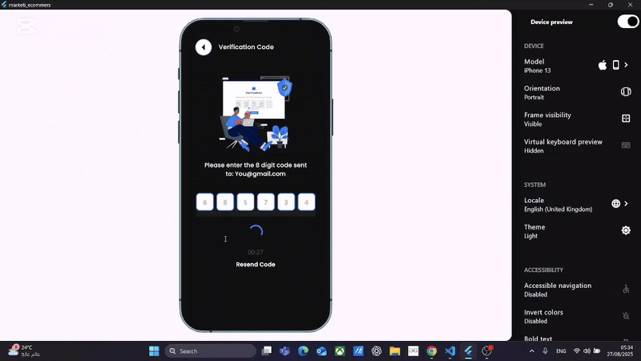 |

---


## License

This project is licensed under the MIT License - see the LICENSE file for details.s

A new Flutter project.

## Getting Started

This project is a starting point for a Flutter application.

A few resources to get you started if this is your first Flutter project:

- [Lab: Write your first Flutter app](https://docs.flutter.dev/get-started/codelab)
- [Cookbook: Useful Flutter samples](https://docs.flutter.dev/cookbook)

For help getting started with Flutter development, view the
[online documentation](https://docs.flutter.dev/), which offers tutorials,
samples, guidance on mobile development, and a full API reference.
